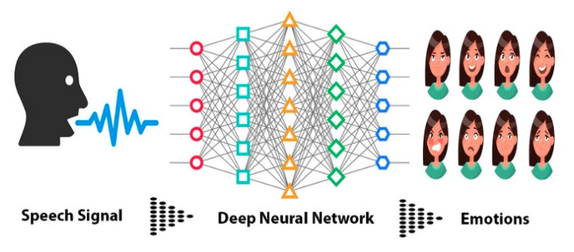
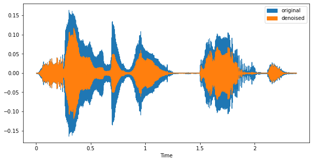
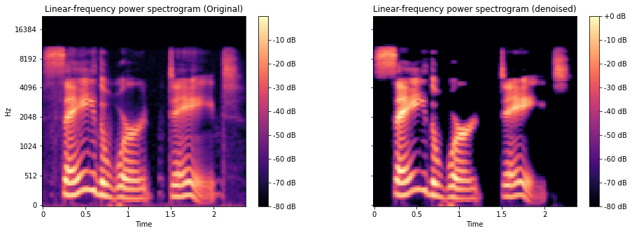
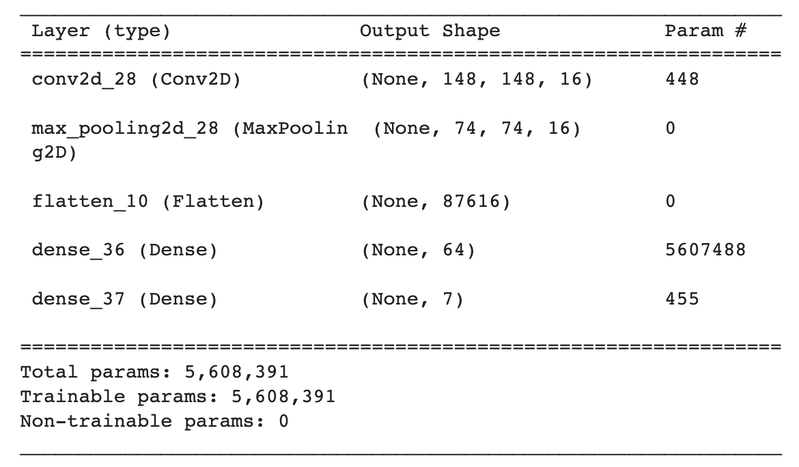
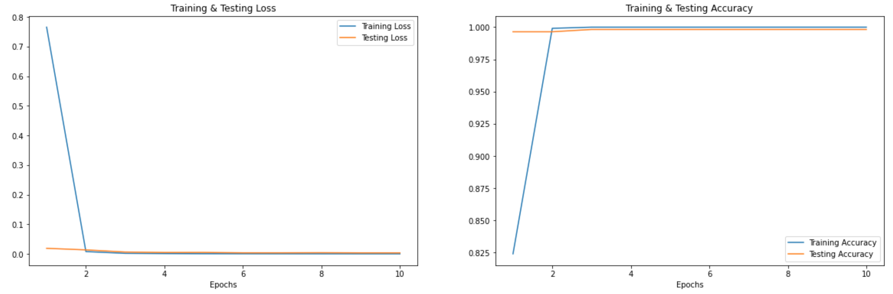

# Emotion-Detection-in-Speech

image from [here](https://medium.com/@raihanh93/speech-emotion-recognition-using-deep-neural-network-part-i-68edb5921229)

# Introduction

The information in speech is conveyed through words and emotion. Depending on how one 
pronounces a word, we can understand different meaning. Therefore, both the word 
and the way it is pronounced affect our understanding of the word. As a result, 
it would be important that we could design a virtual assistant that not only 
does understand the word, but also it understands the emotion in the way the word
is pronounced. 

In this work, we are trying to introduce a machine learning model that can detect the
emotion in the sentence. In order to do so, we are using the audio data provided 
by [University of Toronto](https://tspace.library.utoronto.ca/handle/1807/24487) 
to create a neural network model to detect the emotion in a speech. In order to 
make a model we need to convert the audio files into numerical values. To convert
the audio file to a numerical data, we use python library [librosa](https://librosa.org/)
and to denoise them we used [noisereduce](https://pypi.org/project/noisereduce/).
Afterward we convert the denoised audio files into their corresponding spectrograms 
using which we can train a Convolutional neural network. 

# Project Structure
The arrangement of this work is as follows

1. The folder [`Toronto-Data`](https://github.com/miladshiraniUCB/Emotion-Detection-in-Speech/tree/main/Toronto-Data) contains the audio files we used in this work.
2. The folder [`Notebook`](https://github.com/miladshiraniUCB/Emotion-Detection-in-Speech/tree/main/Notebook) contains the following notebooks:
    * The Exploratory Data Analysis (EDA), Train-Test split and conversion of
    audio files to spectrograms are done in the notebook [`EDA-and-Data-Visualization.ipynb`](https://github.com/miladshiraniUCB/Emotion-Detection-in-Speech/blob/main/Notebook/EDA-and-Data-Visualization.ipynb).
    * The baseline modeling is performed in [`Modeling-LR-XGB-LGBM-TREE.ipynb`](https://github.com/miladshiraniUCB/Emotion-Detection-in-Speech/blob/main/Notebook/Modeling-LR-XGB-LGBM-TREE.ipynb). In this notebook, we used the numerical values obtained by converting
    the audio files to train several categorical classification models which are
    [Logistic Regression](https://scikit-learn.org/stable/modules/generated/sklearn.linear_model.LogisticRegression.html), [Decision Tree](https://scikit-learn.org/stable/modules/tree.html), and ensemble models such as
    [Random Forest](https://scikit-learn.org/stable/modules/generated/sklearn.ensemble.RandomForestClassifier.html), [XGBoost](https://xgboost.readthedocs.io/en/stable/python/python_intro.html) and [LightGBM](https://lightgbm.readthedocs.io/en/v3.3.2/). 
    * In [Modeling-CNN-and-Transfer-Learning.ipynb](https://github.com/miladshiraniUCB/Emotion-Detection-in-Speech/blob/main/Notebook/Modeling-CNN-and-Transfer-Learning.ipynb) we presented some neural network models
    in which we used 2D convolutional layers as well as [`EfficientNetB3`](https://www.tensorflow.org/api_docs/python/tf/keras/applications/efficientnet/EfficientNetB3)
    and [`EfficientNetB7`](https://www.tensorflow.org/api_docs/python/tf/keras/applications/efficientnet/EfficientNetB7).
    
3. The folder [`Train-Test-Split`](https://github.com/miladshiraniUCB/Emotion-Detection-in-Speech/tree/main/Train-Test-Split) contains the training and testing dataframes.
4. The folder [`mel_spectrogram`](https://github.com/miladshiraniUCB/Emotion-Detection-in-Speech/tree/main/mel_spectrogram) contains the spectrograms of the audio files.

# Some Visualizations

In the following figure we showed the effect of denoising of an original audio file

and the corresponding spectrogram for the same audio file for the original and
denoised cases are shown below

# Results and Final Model.

All the neural networks we introduced in the notebook [Modeling-CNN-and-Transfer-Learning.ipynb](https://github.com/miladshiraniUCB/Emotion-Detection-in-Speech/blob/main/Notebook/Modeling-CNN-and-Transfer-Learning.ipynb) performed well with the test accuracies around 99% 
(the transfer learning model [`EfficientNetB7`](https://www.tensorflow.org/api_docs/python/tf/keras/applications/efficientnet/EfficientNetB7) 
has the lowest test accuracy which is about 0.95% after 35 epochs). However, we will
choose the first neural network model as the final model of this work since this
model has the simplest structure and its train and test losses converged after
only 2 epochs. The summary of this model is shown below

the results of this model is shown below

# Recommendations to Improve the Model

For the future work, we would recommend using more data to train the model with
and also we would recommend exploring neural network models in which LSTM layers 
are used and train them with the numerical values of audio files without converting them
to mel-spectrograms. Moreover, we would suggest using MFCCs (Mel Frequency Cepstral
Coefficients) to train machine learning models. 

